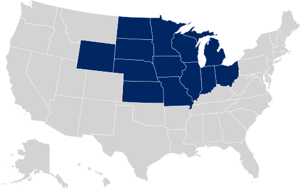

```{r setup, include=FALSE}
knitr::opts_chunk$set(echo = TRUE)
```

/--------------------

*General Procedure*

1. Load data and necessary packages
2. Read in each article (total of 10), clean the data and do individual sentiment analysis and produce word clouds
3. Merge the article data together and do sentiment analysis of the entirety of the Chicago Daily Herald
4. Produce and analyze a sentiment range graph
5. Produce and analyze a word cloud, highlighting the top 50 represented words

/--------------------

<center></center>
<br/>

```{r, include=FALSE}
library(tidyverse)
#install.packages("tidytext")
library(tidytext)
#install.packages("ggwordcloud")
library(ggwordcloud)
# install.packages("gutenbergr") 
library(gutenbergr)
#install.packages('textdata')
library(textdata)
```

```{r, include=FALSE}

# clean the data
clean_data <- function(dataSet, colName) {
  new_data <- dataSet %>%
    unnest_tokens(word, colName) %>%
    anti_join(stop_words) %>%
    count(word, sort=TRUE)
}

# create the sentiment ggplot
sent_ana <- function(dataSet, title) {
  sentiment_affin <- inner_join(dataSet,get_sentiments("afinn"))
  
  ggplot(data = sentiment_affin, 
       aes(x=value)
        )+
  geom_histogram()+
  ggtitle(title)+
  theme_minimal()
}

# create the wordcloud
word_cloud <- function(dataSet) {
  # word cloud
  set.seed(42)
  ggplot(dataSet[1:50,], aes(label = word, size = n)
       ) +
  geom_text_wordcloud() +
  theme_minimal()
}
```


```{r, message=FALSE, include=FALSE}
# 1st Article -- Download and Clean
c_1 <- read_lines("Climate change endangers bird habitats_ then birds.txt")
c_1 <- tibble(c_1)
c_1 <-c_1[1:23,]

c_1$c_1 <- as.character(c_1$c_1)
c_1 <- clean_data(c_1, "c_1")
c_1 <- subset(c_1, !grepl("[0-9]", word))

# ------------------------

sent_ana(c_1, "Climate change endangers bird habitats_ then birds.txt")
word_cloud(c_1)

```

```{r, message=FALSE, include=FALSE}
# 2nd Article -- Download and Clean
c_2 <- read_lines("Climate change has affected 85_ worldwide_ study says.txt")
c_2 <- tibble(c_2)
c_2 <-c_2[1:2,]

c_2$c_2 <- as.character(c_2$c_2)
c_2 <- clean_data(c_2, "c_2")
c_2 <- subset(c_2, !grepl("[0-9]", word))

# ------------------------

sent_ana(c_2, "Climate change has affected 85_ worldwide_ study says.txt")
word_cloud(c_2)
```


```{r, message=FALSE, include=FALSE}
# 3rd Article -- Download and Clean
c_3 <- read_lines("Climate change is real_ and it requires us to act.txt")
c_3 <- tibble(c_3)
c_3 <-c_3[1:2,]

c_3$c_3 <- as.character(c_3$c_3)
c_3 <- clean_data(c_3, "c_3")
c_3 <- subset(c_3, !grepl("[0-9]", word))

# ------------------------

sent_ana(c_3, "Climate change is real_ and it requires us to act.txt")
word_cloud(c_3)
```


```{r, message=FALSE, include=FALSE}
# 4th Article -- Download and Clean
c_4 <- read_lines("Study blames climate change for 37_ of global heat deat.txt")
c_4 <- tibble(c_4)
c_4 <-c_4[1:2,]

c_4$c_4 <- as.character(c_4$c_4)
c_4 <- clean_data(c_4, "c_4")
c_4 <- subset(c_4, !grepl("[0-9]", word))

# ------------------------

sent_ana(c_4, "Study blames climate change for 37_ of global heat deat.txt")
word_cloud(c_4)
```


```{r, message=FALSE, include=FALSE}
# 5th Article -- Download and Clean
c_5 <- read_lines("Talk with your children about climate change Children_.txt")
c_5 <- tibble(c_5)
c_5 <-c_5[1:2,]

c_5$c_5 <- as.character(c_5$c_5)
c_5 <- clean_data(c_5, "c_5")
c_5 <- subset(c_5, !grepl("[0-9]", word))

# ------------------------

sent_ana(c_5, "Talk with your children about climate change Children_.txt")
word_cloud(c_5)
```


```{r, message=FALSE, include=FALSE}
# 6th Article -- Download and Clean
c_6 <- read_lines("The politics of climate change.txt")
c_6 <- tibble(c_6)
c_6 <-c_6[1:2,]

c_6$c_6 <- as.character(c_6$c_6)
c_6 <- clean_data(c_6, "c_6")
c_6 <- subset(c_6, !grepl("[0-9]", word))

# ------------------------

sent_ana(c_6, "The politics of climate change.txt")
word_cloud(c_6)
```

```{r, message=FALSE, include=FALSE}
# 7th Article -- Download and Clean
c_7 <- read_lines("What a changing climate means for government.txt")
c_7 <- tibble(c_7)
c_7 <-c_7[1:2,]

c_7$c_7 <- as.character(c_7$c_7)
c_7 <- clean_data(c_7, "c_7")
c_7 <- subset(c_7, !grepl("[0-9]", word))

# ------------------------

sent_ana(c_7, "The politics of climate change.txt")
word_cloud(c_7)
```

```{r, message=FALSE, include=FALSE}
# 8th Article -- Download and Clean
c_8 <- read_lines("Why are the Great Lakes rising_.txt")
c_8 <- tibble(c_8)
c_8 <-c_8[1:2,]

c_8$c_8 <- as.character(c_8$c_8)
c_8 <- clean_data(c_8, "c_8")
c_8 <- subset(c_8, !grepl("[0-9]", word))

# ------------------------

sent_ana(c_8, "Why are the Great Lakes rising_.txt")
word_cloud(c_8)
```

```{r, message=FALSE, include=FALSE}
# 9th Article -- Download and Clean
c_9 <- read_lines("World Bank_ Climate change could result in 100 million.txt")
c_9 <- tibble(c_9)
c_9 <-c_9[1:16,]

c_9$c_9 <- as.character(c_9$c_9)
c_9 <- clean_data(c_9, "c_9")
c_9 <- subset(c_9, !grepl("[0-9]", word))

# ------------------------

sent_ana(c_9, "World Bank_ Climate change could result in 100 million.txt")
word_cloud(c_9)
```

```{r, message=FALSE, include=FALSE}
# 10th Article -- Download and Clean
c_10 <- read_lines("_Americans are waking up__ two-thirds say climate crisi.txt")
c_10 <- tibble(c_10)
c_10 <-c_10[1:2,]

c_10$c_10 <- as.character(c_10$c_10)
c_10 <- clean_data(c_10, "c_10")
c_10 <- subset(c_10, !grepl("[0-9]", word))

# ------------------------

sent_ana(c_10, "_Americans are waking up__ two-thirds say climate crisi.txt")
word_cloud(c_10)
```


```{r, include=FALSE}
# Merge all the 10 articles into ONE newspaper dataset
merge_datasets <- function(df1, df2) {
  df_combined <- merge(df1, df2, by="word", all.x=T, all.y=T)
  df_combined <- subset(df_combined, !grepl("[0-9]", word))
  df_combined$n <- rowSums(df_combined[,c("n.x", "n.y")], na.rm=TRUE)
  df_combined <- df_combined[, -c(2:3)]
  return(df_combined)
}

first_merge <- merge_datasets(c_1, c_2)
second_merge <- merge_datasets(first_merge, c_3)
third_merge <- merge_datasets(second_merge, c_4)
fourth_merge <- merge_datasets(third_merge, c_5)
fifth_merge <- merge_datasets(fourth_merge, c_6)
sixth_merge <- merge_datasets(fifth_merge, c_7)
seventh_merge <- merge_datasets(sixth_merge, c_8)
eigth_merge <- merge_datasets(seventh_merge, c_9)
c_combined <- merge_datasets(eigth_merge, c_10)

all_ChicagoDH <- c_combined %>%
  arrange(desc(n))

head(all_ChicagoDH)

```


```{r, message=FALSE, include=FALSE}
# Read the raw text for ALL articles and convert to tibble
c1 <- as.tibble(read_lines("Climate change endangers bird habitats_ then birds.txt"))
c2 <- as.tibble(read_lines("Climate change has affected 85_ worldwide_ study says.txt"))
c3 <- as.tibble(read_lines("Climate change has affected 85_ worldwide_ study says.txt"))
c4 <- as.tibble(read_lines("Study blames climate change for 37_ of global heat deat.txt"))
c5 <- as.tibble(read_lines("Talk with your children about climate change Children_.txt"))
c6 <- as.tibble(read_lines("The politics of climate change.txt"))
c7 <- as.tibble(read_lines("What a changing climate means for government.txt"))
c8 <- as.tibble(read_lines("Why are the Great Lakes rising_.txt"))
c9 <- as.tibble(read_lines("World Bank_ Climate change could result in 100 million.txt"))
c10 <- as.tibble(read_lines("_Americans are waking up__ two-thirds say climate crisi.txt"))

data_prep <- function(x,y,z){
  i <- as_tibble(t(x))
  ii <- unite(i,"text",y:z,remove = TRUE,sep = "")
}

# Prep all the data for tf-idf analysis
c1_prep <- data_prep(c1,'V1','V23') 
  # 'V...' = variable # to variable #
c2_prep <- data_prep(c2,'V1','V2')
c3_prep <- data_prep(c3,'V1','V2')
c4_prep <- data_prep(c4, 'V1', 'V2')
c5_prep <- data_prep(c5, 'V1', 'V2')
c6_prep <- data_prep(c6, 'V1', 'V2')
c7_prep <- data_prep(c7, 'V1', 'V2')
c8_prep <- data_prep(c8, 'V1', 'V2')
c9_prep <- data_prep(c9, 'V1', 'V16')
c10_prep <- data_prep(c10, 'V1', 'V2')

# The specified column names for each article
chicagoDH <- c("c1","c2","c3", "c4", "c5", "c6", "c7", "c8", "c9", "c10")

tf_idf_text <- tibble(chicagoDH,text=t(tibble(c1_prep,c2_prep,c3_prep,c4_prep,c5_prep, c6_prep, c7_prep, c8_prep, c9_prep, c10_prep,.name_repair = "universal")))  # combine all "tibbles" into one dataset

# Count the individual word count by each article
word_count <- tf_idf_text %>%
  unnest_tokens(word, text) %>%
  count(chicagoDH, word, sort = TRUE)

# Count the total words by each article
total_words <- word_count %>% 
  group_by(chicagoDH) %>% 
  summarize(total = sum(n))

# Create a dataset that combines both the total and word counts
newspaper_words <- left_join(word_count, total_words)
newspaper_words

# Calculates the tf-idf for each word
newspaper_words <- newspaper_words %>%
  bind_tf_idf(word, chicagoDH, n)
  # tf-idf is the tf multiplied by idf
newspaper_words_new <- newspaper_words %>%
  distinct(word, .keep_all=TRUE) %>%
  anti_join(stop_words)

write.csv(newspaper_words_new, "/Users/sarah/Documents/UVA/DS 3001/midwest.csv", row.names=FALSE)

```

/--------------------

To provide insight into individual word importance per article, a TF-IDF analysis is created. Each article is denoted by "c#" where "#" is the particular article number it represents. From this analysis, I am able to have the ability to see the term frequency (TF) relative to the Chicago Daily Herald as a whole, and the inverse document frequency (IDF) to understand how much that specific term is present in that particular article. Sorted from highest to lowest, the tf-idf represents the most critical word to that particular article in the scheme of the Chicago Daily Herald (Corpus).

```{r}
newspaper_words_new[order(newspaper_words_new$tf_idf, decreasing=T, na.last=F),]
```
The highest tf-idf value from the output is the word "lakes" from the 8th analyzed article, or "c8", which describes the relation between climate change the rising of the Great Lakes. This demonstrates that "lakes" is important on a local level to the article and also in terms of all the articles accumulated together. Similarly, the second highest tf-idf value is "birds" from the 1st analyzed article, or "c1," which is an article describing the endangerment of bird habits from the impacts of climate change. Once again, the word "birds" is rightfully important most specifically to that article when compared to all the other articles as a whole. From this analysis, it is important to understand the frequency of words as they appear in individual articles and understand how that relates to the comparison between the variance in word frequencies across all documents.

/--------------------

```{r, include=FALSE}
# Sentiment Analysis of Combined Dataset

get_sentiments('afinn')
get_sentiments('nrc')
get_sentiments('bing')

# ------------------------

c_sentiment_affin <- newspaper_words_new %>%
  inner_join(get_sentiments("afinn")) %>% # using a inner join to match words and add the sentiment variable
  anti_join(stop_words)

c_sentiment_nrc <- newspaper_words_new %>%
  inner_join(get_sentiments("nrc"))

c_sentiment_bing <- newspaper_words_new %>%
  inner_join(get_sentiments("bing"))

```

```{r}
# Table format of the categorized words
table(c_sentiment_nrc$sentiment)
```

In terms of the articles as a whole and the "nrc" sentiment, there is a mostly even representation of both positive and negative words. There is a slight increase in the number of positive words, with the majority of which being classified under "trust." Relating to the topic being analyzed, climate change is a rather neutral topic that aims to bring attention to climate change awareness. In the Midwest region, the negative impact of climate change isn't as evident compared to other regions experiencing forest fires or droughts from global warming; therefore, the limited variance between the number of negative and positive is expected.

/--------------------

```{r, message=FALSE}
# Plot the sentiment range w/o stop words
ggplot(data = c_sentiment_affin, 
       aes(x=value)
        )+
  geom_histogram()+
  ggtitle("Chicago Daily Herald Sentiment Range")+
  theme_minimal()
```


In opposition to the "nrc" sentiment analysis, the "affin" sentiment analysis indicated a slighlty larger representation of negative words than positive words. The positive words are more evenly spread out among the various levels of positivity (0-3), whereas the negative words have a higher representation of the "-2" level of negativity. This can be related to the more moderate negative words that are referenced to climate change. Similarly, the positive words use more moderate references and are not overly positive comparatively. The reasoning for this can be reiterated from the section above where climate change, in terms of the Midwest, is relatively more of a neutral topic and therefore does not include either overly negative or overly positive words.

/--------------------

```{r}
# Make a word cloud w/o stop words
set.seed(42)
ggplot(newspaper_words_new[1:50,], aes(label = word, size = n)
       ) +
  geom_text_wordcloud() +
  theme_minimal()
```

Indicated in the word cloud, the top represented words are typical of climate change topics, specifically: climate, change, global, warming, heat. However, the words specific to the Midwest would include: lakes, water, Chicago, birds. These words are related to the area distinctive to the Midwest, such as the Great Lakes. This word cloud is visually as expected, with the inclusion of more general climate change words but also the inclusion of Midwest-specific terms.
In the table outputted below, it includes the top 25 words, sorted from most significant to least significant.

<br/>

```{r}
# Top 25 words in the Midwest
top_25 <- newspaper_words_new[1:25,2] %>%
  rename(midwest.top25=word)
head(top_25)
```

/--------------------